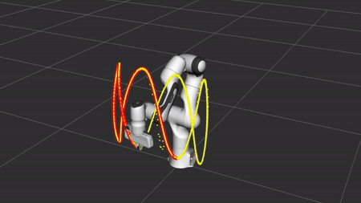

# panda-controllers - [project-adaptive](https://github.com/CentroEPiaggio/panda_controllers/tree/project_adaptive)



Here you can find adaptive controller and some classes implemented with casadi library to generalize the problem.

## Table of Contents
1. [Requirements](#markdown-header-requirements)
1. [Installation](#markdown-header-installation)
   1. `project-adaptive` 
   1. `casadi`
   1. `yaml-cpp`
1. [Running controllers](#markdown-header-overviews)
1. [To Do](#markdown-header-to-do)

## Requirements 
* To use this controllers you need to install the package [franka_ros](https://github.com/CentroEPiaggio/franka_ros.git) in your workspace.
* If you want use and/or modify implemented casadi classes you have to install [casadi](https://github.com/casadi/casadi.git).
* If you want generate yaml file you have to install [yaml-cpp](https://github.com/jbeder/yaml-cpp.git).

## Installation

Steps for installation:

### project-adaptive - from source

1. Clone the `panda_controllers` branch `project-adaptive` to your Catkin Workspace, e.g. `~/catkin_ws`:
   ```
   cd ~/catkin_ws/src
   git clone --branch project-adaptive https://github.com/CentroEPiaggio/panda_controllers.git
   ```

1. Compile the package using `catkin`:
   ```
   cd ~/catkin_ws
   catkin_make
   ```

### casadi - from source
   
Before continue check the instructions of installation in the official [API site](https://casadi.sourceforge.net/api/html/d3/def/chapter2.html), [git repostery](https://github.com/casadi/casadi.git) and [website](https://web.casadi.org/).

That are following:

1. Clone the `main` repostery of `casadi`:
   ```
   git clone https://github.com/casadi/casadi.git -b main casadi

   ```

1. Set the environment variable `CMAKE_PREFIX_PATH` to inform CMake where the dependecies are located. For example if headers and libraries are installed under `$HOME/local/`, then type:
   ```
   export CMAKE_PREFIX_PATH=$HOME/local/

   ```

1. Make install
   ```
   cd casadi; mkdir build; cd build
   cmake ..
   ccmake ..
   make
   make install
   ```

### yaml-cpp - from .zip

Before continue follow installation instruction from repostery https://github.com/jbeder/yaml-cpp.

That are following:

1. Download local clone .zip from https://github.com/jbeder/yaml-cpp and extract.
1. Navigate into the source directory and run:
   ```
   mkdir build; cd build
   cmake ..
   cmake --build .
   make
   sudo make install
   ```

## Running controllers

In the package, there is a launch file related to the spawning of controller `panda_controllers_sim.launch`, that is useful to set type of controller and rviz visualization.

## To do

* [-] implement a class that convert URDF parametrization file in Denavit-Hartenberg parametrization
* [-] implement a class that generalize integrations of name of casadi functions with ThunderPanda class 
